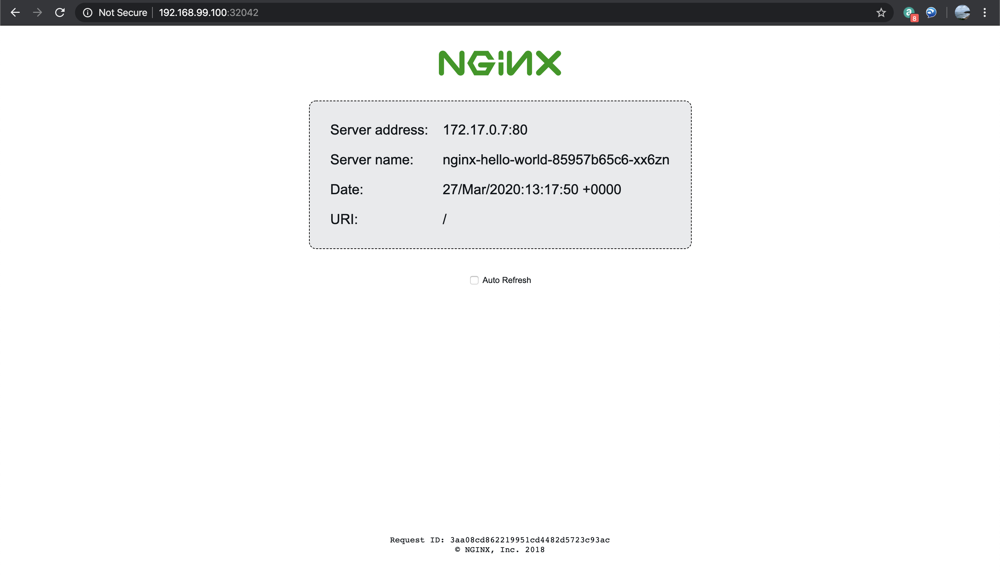

# Running Nginx service on Kubernetes

## Minikube installation
1) Refer to https://kubernetes.io/docs/tasks/tools/install-minikube/ for installation steps.
2) Before the installation, ensure the preferred hypervisor (virtualbox is preferred) is installed on your local machine unless you would like to install it on the local machine without hypervisor. In this case, you need docker or podman for minikube to run on the local machine.
3) Next, download the minikube binary following the steps of the OS of your local machine, in my case MacOS, `$ curl -Lo minikube https://storage.googleapis.com/minikube/releases/latest/minikube-darwin-amd64` then make the file executable `$ chmod +x minikube`. Lastly, add the minikube to  your path `$ sudo mv minikube /usr/local/bin/`.

## Kubectl installation
1) In order to interact with your minikube cluster, the Kubernetes CLI tool `kubectl` is needed to deploy applications, inspect and manage cluster resources, and view logs.
2) Refer to https://kubernetes.io/docs/tasks/tools/install-kubectl/#before-you-begin for installation steps.
3) Again, since I'm using MacOS, download the binary `$ curl -LO "https://storage.googleapis.com/kubernetes-release/release/$(curl -s https://storage.googleapis.com/kubernetes-release/release/stable.txt)/bin/darwin/amd64/kubectl"` then make the file executable `$ chmod +x ./kubectl`. Lastly, add the kubectl to your path `$ sudo mv ./kubectl /usr/local/bin/kubectl`

## Bring up the KUBE!
1) Once minikube and kubectl binaries are ready, it's time to bring up the minikube cluster (i mean node..). 
2) In the terminal, run `minikube start --driver=<driver_name>`, the driver_name is the name of the hypervisor installed on the local machine. eg. virtualbox
3) Check that the minikube node is running normally by running `minikube status`. If the output is like this, it's all set!
```
host: Running
kubelet: Running
apiserver: Running
kubeconfig: Configured
```
## Deploy the Nginx and expose it as service
1) Firstly, Nginx Hello World application must be deployed as deployment (you don't say) in kubernetes because ReplicaSet is useful to handle self-healing and replication. 
2) In this assignement, the replicas is set as 2 so that 2 Nginx pods will be deployed as defined in deploy_nginx.yml file.
3) Run `kubectl apply -f deploy_nginx.yml` to trigger the deployment to the cluster.
4) Check that there are 2 pods running in the cluster by running `kubectl get deployment nginx-hello-world`
```
NAME                READY   UP-TO-DATE   AVAILABLE   AGE
nginx-hello-world   2/2     2            2           69m
```
5) Next, the Nginx Hello World deployment must be exposed as Service because pods come and go and same goes to the IP addressess that are assigned to the pods. A stable IP and domain name are needed to route the traffic to the intended pods that are serving the application. There are many ways to handle container networking but for the scope of this assignement, NodePort is used to allow connection outside of the cluster.
6) As seen in nginx_service.yml, the NodePort is exposed as 32042 and it will forward to port 80 of the Nginx endpoint.
7) Run `kubectl apply -f nginx_service.yml` to expose the Nginx deployment as service.
8) Check that the nginx-hello-world service has been assigned a cluster IP and the port mapping of 32042 to 80 by running `kubectl get svc nginx-hello-world`
```
NAME                TYPE       CLUSTER-IP       EXTERNAL-IP   PORT(S)        AGE
nginx-hello-world   NodePort   10.101.125.102   <none>        80:32042/TCP   80m
```
## Access the Nginx Hello World service
1) The cluster IP assigned to the nginx-hello-world is not routable accessing from outside the cluster. Hence, the minikube ip must be used instead. To check the minikube ip, run `minikube ip`.
> 192.168.99.100
2) Using your favorite browser, type `<minikube_ip>:<node_port>` eg. 192.168.99.100:32042 then you will see a nice Nginx page as seen below.



-- curl output

```
<!DOCTYPE html>
<html>
<head>
<title>Hello World</title>
<link href="data:image/png;base64,iVBORw0KGgoAAAANSUhEUgAAAEAAAABACAYAAACqaXHeAAAGPElEQVR42u1bDUyUdRj/iwpolMlcbZqtXFnNsuSCez/OIMg1V7SFONuaU8P1MWy1lcPUyhK1uVbKcXfvy6GikTGKCmpEyoejJipouUBcgsinhwUKKKJ8PD3vnzsxuLv35Q644+Ue9mwH3P3f5/d7n6/3/3+OEJ/4xCc+8YQYtQuJwB0kIp+JrzUTB7iJuweBf4baTlJ5oCqw11C/JHp+tnqBb1ngT4z8WgReTUGbWCBGq0qvKRFcHf4eT/ZFBKoLvMBGIbhiYkaQIjcAfLAK+D8z9YhjxMgsVUGc84+gyx9AYD0khXcMfLCmUBL68HMZ+PnHxyFw3Uwi8B8hgJYh7j4c7c8PV5CEbUTUzBoHcU78iIl/FYFXWmPaNeC3q4mz5YcqJPI1JGKql2Z3hkcjD5EUznmcu6qiNT+Y2CPEoH3Wm4A/QERWQFe9QQ0caeCDlSZJrht1HxG0D3sOuCEiCA1aj4ZY3Ipzl8LiVtn8hxi5zRgWM8YYPBODF/9zxOLcVRVs+YGtwFzxCs1Bo9y+avBiOTQeUzwI3F5+kOwxsXkkmWNHHrjUokqtqtSyysW5gUHV4mtmZEHSdRkl+aELvcFIRN397gPPXD4ZgbxJW1S5OJdA60MgUAyHu1KfAz+pfCUtwr+HuQc8ORQ1jK4ZgGsTvcY5uQP5oYkY2HfcK5sGLpS6l1xZQwNn7Xkedp3OgMrWC1DX0Qwnms/A1rK9cF9atNVo18DP/3o5fF99BGo7LFDRWgMJJQaYQv/PyOcHySP0TITrBIhYb+WSHLrlNGEx5NeXgj2paW8C5rs46h3Dc3kt3G2Ogr9aqoes+f5RvbL1aJ5iXnKnxkfIEoB3N/zHeHAmF9ovwryvYvC9TysnICkEonPX212vvOU8+As6eS+QCDAw0aNLABq6LO8DkJMSSznMMEfScFFGwCJYXbDV7lq17RYIQu+QTYpjRUBM3gZQIt+cOwyTpWRpYBQRsKrgU4ceNS4JkCSxLI1+ZsIS0NvXB6sLE/tL5EQkQJKOm52YON9y7glqJkCSOqzrD6Uvc1wZ1EBA07V/IafmN4ckHG+ugJkSEHuVQQ0ENFy9BLP3R0NR4ymHJGRWFWBnZ6fPVwMBF9EDgrD2z0USqtoaHJKw49SBoZ2dWggIxmcEsvspYLLi4PKNDrvv68OfuKLt/68MqiJAan4Q0IpDm6G7r8fue692X4fI7PiByqA6AqygNh0XHIaClDOkpz9aGVRJABo8CTP+3sqfHZJQeqkSgvHZn+xaqEICKAlhECSGO60MWdVF4IcesDL/ExUSYN3okCrD31fqHZLwcWkq5owPVUoA3UcIgdBv10BrV7vdz3b39kBhw0kVE2BNirG/bqRghyPqIcBKQkKJcVgE1LQ1wR3S5ooqCDBKlSEUzGdyFBNwvq1RTQT0b4BOF5+BgoayCUqAtTLMSXsRzl6uHX8EONoUtXS2KCfAusOsyVwFLV1tznNAuzflAGxb+R/esGuodDcD0bUVbYLelhRf/mWD08ogdYtTjNwYbIsrORhBIwJMPOTWHh1i6Lriz107FUKviivcZvfp8WZvN8TmbVS2rtsHI8mMtn9gSe50KAz79yWw8490OGYpp8lsTUGictd3EA6PHVwB20+mYUNURo/aMs4dhqjsdcoOWGxH5yYu0g0P0EzFBd7DxZoVHY7aHmWtB6VunwhLB6P0gFULk6zhJnvnBw5HW9D9N5GkpQEjMBcQOg+JMBNxjMZgHISawvGZHiKw+0mybv5ozP0txgvk07AQvWxAoh98sXsur3RmwMStxIud9fiIzMAIXTV6yNqxHaH7gg1GA7bgxVvHfEjq1hAl10ZM/A46gO0x0bOPoiHpSEDvsMZhXVVbVRL4TLz2E140EK1dgsnnd9mBaHcmwuigJHeCGLkXvHNaNHOBP4J/HYmoGbGwsJU1ka0nAvM2ht40758ZNmvvRRJ24l3roMa7MxVq4jpRdyMRc8bh9wR0TyIRWdR9hzNXaJs3Ftif6KDWuBcBH0hErky2bNraV5E9jcBjiapE1ExHkO8iEY1OvjLTjAkugezh7ySqFUPoXHTtZAR7ncY4rRrYYgtcCtGHPUgmjEhPmiKXjXc/l4g6HfGJT3ziEw/If86JzB/YMku9AAAAAElFTkSuQmCC" rel="icon" type="image/png" />
<style>
body {
  margin: 0px;
  font: 20px 'RobotoRegular', Arial, sans-serif;
  font-weight: 100;
  height: 100%;
  color: #0f1419;
}
div.info {
  display: table;
  background: #e8eaec;
  padding: 20px 20px 20px 20px;
  border: 1px dashed black;
  border-radius: 10px;
  margin: 0px auto auto auto;
}
div.info p {
    display: table-row;
    margin: 5px auto auto auto;
}
div.info p span {
    display: table-cell;
    padding: 10px;
}
img {
    width: 176px;
    margin: 36px auto 36px auto;
    display:block;
}
div.smaller p span {
    color: #3D5266;
}
h1, h2 {
  font-weight: 100;
}
div.check {
    padding: 0px 0px 0px 0px;
    display: table;
    margin: 36px auto auto auto;
    font: 12px 'RobotoRegular', Arial, sans-serif;
}
#footer {
    position: fixed;
    bottom: 36px;
    width: 100%;
}
#center {
    width: 400px;
    margin: 0 auto;
    font: 12px Courier;
}

</style>
<script>
var ref;
function checkRefresh(){
    if (document.cookie == "refresh=1") {
        document.getElementById("check").checked = true;
        ref = setTimeout(function(){location.reload();}, 1000);
    } else {
    }
}
function changeCookie() {
    if (document.getElementById("check").checked) {
        document.cookie = "refresh=1";
        ref = setTimeout(function(){location.reload();}, 1000);
    } else {
        document.cookie = "refresh=0";
        clearTimeout(ref);
    }
}
</script>
</head>
<body onload="checkRefresh();">

<div class="info">
<p><span>Server&nbsp;address:</span> <span>172.17.0.7:80</span></p>
<p><span>Server&nbsp;name:</span> <span>nginx-hello-world-85957b65c6-xx6zn</span></p>
<p class="smaller"><span>Date:</span> <span>27/Mar/2020:14:24:48 +0000</span></p>
<p class="smaller"><span>URI:</span> <span>/</span></p>
</div>
<div class="check"><input type="checkbox" id="check" onchange="changeCookie()"> Auto Refresh</div>
    <div id="footer">
        <div id="center" align="center">
            Request ID: 7b9a972cb42b006b48d8f790c87a80aa<br/>
            &copy; NGINX, Inc. 2018
        </div>
    </div>
</body>
</html>
```
